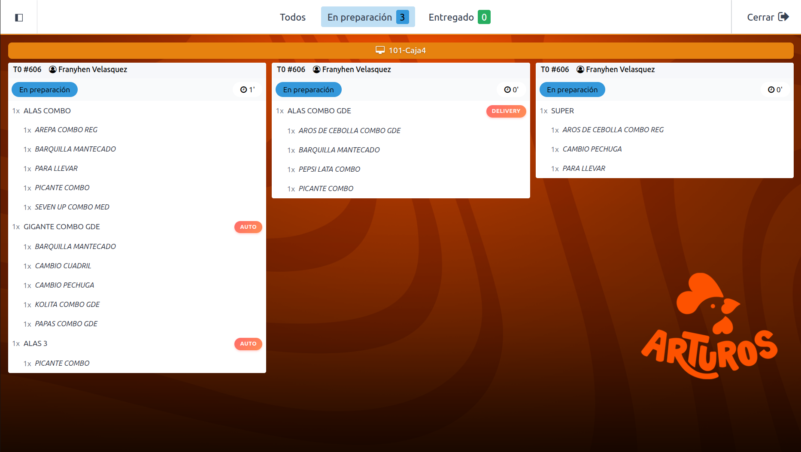
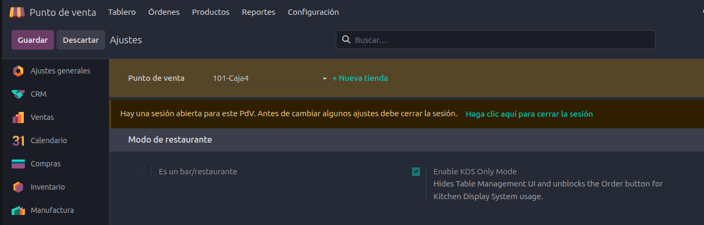
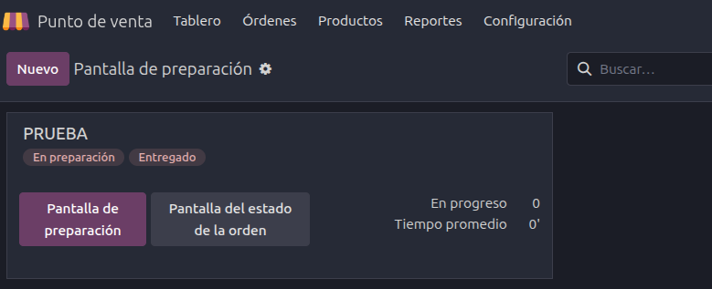
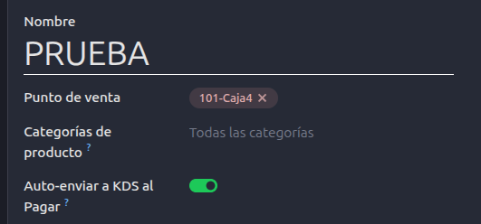
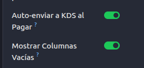
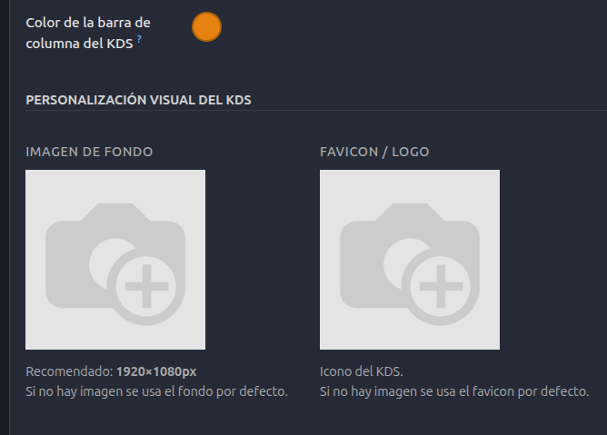
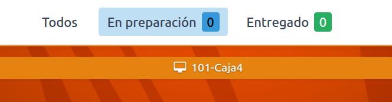
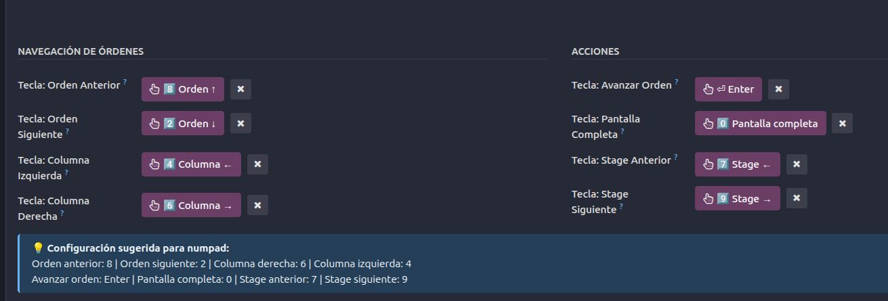
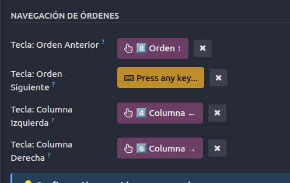
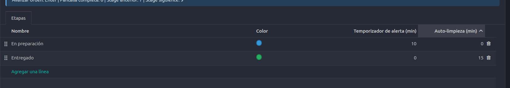

  <h1>🍳 Odoo 18 KDS Pro Customization</h1>
  
<strong>Un nivel superior de personalización y optimización para el Kitchen Display System (KDS) nativo de Odoo 18 Enterprise.</strong>

 

Este módulo nace como una solución de desarrollo personal para extender las capacidades nativas del **Odoo 18 Point of Sale (POS) & KDS**. Va mucho más allá de las funciones base, inyectando un rediseño de UI/UX moderno, soporte para flujos de caja inactivos, personalización dinámica de identidad visual y métricas optimizadas que en el futuro estarán listas para ser consumidas por equipos de Business Intelligence (como Power BI).

Desarrollado cuidando estrictamente las dependencias y directrices arquitectónicas de la **v18 Enterprise**.

---

## ✨ Características Principales

- **⚡ Optimización Extrema del Rendimiento:** Manejo nativo de _indexación de UUIDs_, llamadas asíncronas optimizadas y _batching_ para bases de datos gigantes (testeado con más de 30 millones de líneas de orden), reduciendo el tiempo de carga del KDS de 15 segundos a menos de 500ms.
- **🎨 Personalización Visual Dinámica:** Dile adiós a los fondos estáticos de Odoo. Este módulo permite configurar fondos de pantalla, favicon propio y colores de cabecera personalizados por cada pantalla de KDS, reflejando el branding exacto de la empresa.
- **⌨️ Navegación por Teclado:** Totalmente preparado para operaciones en cocinas rápidas sin pantallas táctiles. Control total mediante teclado (Numpad) configurable por el usuario final.
- **⏱️ Auto-Limpieza y Avance de Órdenes:** Un temporizador asíncrono avanza órdenes de etapa o las elimina de pantalla automáticamente tras pasar su límite de tiempo.
- **👤 Diseño Limpio del Ticket:** Enfoque centrado en el cliente. Muestra claramente la información relevante del comensal, eliminando redundancias innecesarias del cajero en el KDS.

---

## 🚀 Guía de Configuración Paso a Paso

Sigue esta guía visual para configurar tu entorno KDS Pro:

### 1. Habilitar la Funcionalidad KDS en la Caja

Con la sesión de Punto de Venta **Cerrada**, dirígete a los ajustes del POS y habilita el check de KDS.

> ****

### 2. Crear una Pantalla de Preparation Display

Ve a _Punto de Venta > Configuración > Preparation Displays_ y crea una nueva pantalla (por ejemplo: `PRUEBA`). Aquí encontrarás el corazón del módulo.

> ****

#### 🔀 Auto-enviar a KDS al Pagar

Si **activas** este campo, la orden viajará instantáneamente a la cocina apenas el cliente pague su factura en el POS.
Si lo mantienes **desactivado**, el cajero tendrá que presionar explícitamente el botón "Order" en su pantalla para disparar el pedido al KDS.

> ****

#### 📋 Mostrar Columnas Vacías

Este campo te permite forzar a que la columna de la caja aparezca en la pantalla KDS _incluso si no tiene órdenes activas_. Ideal para cocinas con múltiples pantallas, para saber exactamente qué columna le pertenece a qué caja en el monitor. Si te incomoda el espacio vacío, desactívalo y solo aparecerán los indicadores cuando entre un pedido.

> ****

#### 🖌️ Personalización Visual del KDS

Aquí la magia ocurre:

- **Color Cabecera (POS):** Un verdadero _Color Picker_. Elige el tono exacto (Hex/RGB) que quieres para el título de esa columna.
- **Imagen de Fondo & Favicon:** Sube el logo de tu restaurante y el fondo que desees. La pantalla dejará de ser aburrida.

> ****

> ****

### 3. Navegación Avanzada (Menú Inferior)

En la parte inferior del formulario, cuentas con las configuraciones operativas:

- **Navegación por Teclado:** Al no contar con pantallas táctiles, mapea el teclado numérico (`8, 2, 4, 6`, etc.) para volar entre las tarjetas de los pedidos.
- **Etapas y Tiempos de Auto-limpieza:** Ajusta en cuántos minutos quieres que una orden pase a la siguiente etapa de preparación sola, o que desaparezca en caso de estar en "Entregado" sin haber sido despachada por el mesero.

  > ****

  > ****

  > ****

---

## 👨‍💻 Acerca del Autor

**Frany Velasquez**
_ERP Developer & Odoo Expert_

- **Email:** <zerodaty@gmail.com>
- **GitHub:** [https://github.com/zerodaty](https://github.com/zerodaty)
- **Licencia del Módulo:** LGPL-3

> **🇻🇪 Orgullosamente desarrollado en Venezuela.**

Si este proyecto te parece útil o te interesa colaborar en las futuras métricas de Power BI, ¡Siéntete libre de clonarlo, estrellarlo (⭐) o contactarme!
